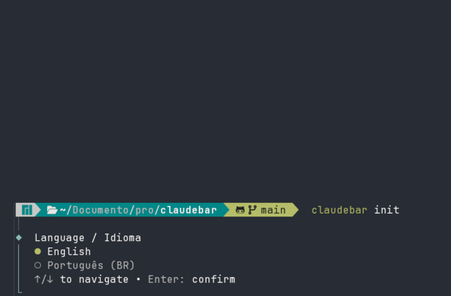

<div align="center">

# 🛰️ claudelobby

**A multi-line, time-aware status bar for [Claude Code](https://claude.com/claude-code).**

Compose widgets — news headlines, football scores, the live World Cup scoreboard —
into the status line at the bottom of your terminal, and swap what's shown by time of day.

**[gomeslucasm.github.io/claudelobby →](https://gomeslucasm.github.io/claudelobby/)**


</div>

---

claudelobby plugs into Claude Code's `statusLine` hook, so it shows up automatically while you work. Each line **cycles** through its items every few seconds. Already using a status line tool like `ccstatusline`? claudelobby keeps it running as one of its lines.

```text
[UOL] Sánchez, do Peru, diz que não reconhecerá resultados do segundo turno…  http://spoo.me/…  (8s)
FT | Portugal (C. Ronaldo 6', N. Mendes 17', C. Ronaldo 39', A. Nematov 60' (gc)) 5 x 0 Uzbekistan  (8s)
[BBC-sport] The trial that saved Antoine Semenyo's career  http://spoo.me/BhJrmH  (8s)
```

## ✨ Features

- **🧩 Widgets** — news, football news, and a live FIFA World Cup scoreboard (with scorers next to each team).
- **🪄 Wraps your existing status line** — keep `ccstatusline` or any custom command as one line.
- **🗂️ Profiles** — named sets of lines you switch by hand, or have switch automatically by time of day.
- **🌍 Bilingual** — English and Portuguese (BR).
- **⚡ Cached & fast** — network data is cached with short TTLs so the bar stays snappy.

## 📋 Requirements

- **Node.js 18+** (developed on Node 22)
- **Claude Code** installed, with a `~/.claude/settings.json` (created the first time you run Claude Code)

## 📦 Install

claudelobby isn't on npm yet. The simplest way is to install it straight from GitHub:

```bash
npm install -g github:gomeslucasm/claudelobby
```

That puts the `claudelobby` command on your `PATH`. Run the same command again to update. The build output (`dist/`) is committed, so the install needs no compiler and no build step — handy behind locked-down corporate networks.

<details>
<summary>Install from a local clone instead</summary>

```bash
git clone https://github.com/gomeslucasm/claudelobby.git
cd claudelobby
npm install      # runtime deps only
npm link         # makes the `claudelobby` command available globally
```

`dist/` ships in the repo, so this works without building. If you change the source, run `npm run build`. If you'd rather not link, call `node /path/to/claudelobby/dist/cli/index.js` directly.
</details>

## 🚀 Quick start

```bash
claudelobby init
```



The interactive setup walks you through:

1. **Language** — English or Portuguese (BR).
2. **Profiles** — one or more named sets of lines (e.g. `default`, `matchday`), and what goes in each line.
3. **Switching** *(optional)* — times of day to switch profile automatically.
4. **Hook up Claude Code** — it offers to write the `statusLine` entry into `~/.claude/settings.json` for you. Say yes and you're done.

Restart Claude Code and the bar appears. If claudelobby detects an existing status line tool, it offers to keep it as one of the lines so you don't lose what you had.

## 🧩 Widgets

Each line is one or more widgets that **rotate** — every few seconds the line advances to the next item.

| Widget | What it shows |
|---|---|
| **`worldcup`** | Live FIFA World Cup scoreboard — live / finished / upcoming matches, with scorers next to each team (`Portugal (Ronaldo 6') 1 x 0 Uzbekistan`). Data from ESPN. |
| **`news`** | RSS headlines. Built-in: `G1`, `Folha`, `UOL`, `HN`, `TechCrunch`, `Ars`, `Verge`. |
| **`soccer`** | Football news. Built-in: `GloboEsporte`, `ESPN-soccer`, `BBC-sport`, `UOL-esporte`. |
| **`passthrough`** | Runs any command and shows its output verbatim — use it to wrap `ccstatusline` or your own script. Always solo (can't share a line). |

Content widgets (`news`, `soccer`, `worldcup`) can be combined on one line and rotate together. `passthrough` always takes a line to itself. You pick the **seconds per item** per widget during setup (5–30s).

## 🗂️ Profiles

A **profile** is a complete, named set of lines — e.g. `default` and `matchday`. Manage them straight from the CLI, no need to re-run `init`:

```bash
claudelobby profile                 # list profiles, marks the active one
claudelobby profile use matchday    # switch by hand
claudelobby profile add matchday    # build a new profile's rows
claudelobby profile edit default    # rebuild a profile's rows
claudelobby profile remove matchday # delete it (aliases: rm, delete)
```

Or schedule switches by time of day. Each **switch** flips the active profile at a wall-clock time; a manual switch holds until the next scheduled one fires. The day wraps past midnight, so the last switch of the day carries over into the early hours.

```bash
claudelobby profile switch add 18:00 matchday
claudelobby profile switch add 23:00 default
claudelobby profile switch remove 18:00
```

> Example: a `default` profile during the day, switch to `matchday` at 18:00, back to `default` at 23:00.

Deleting a profile also removes any scheduled switches that pointed to it, and re-points the active profile if needed.

## ⚙️ Configuration

Config lives at `~/.claudelobby/config.json`. Re-run `claudelobby init` to rebuild it interactively, or edit the JSON directly:

```jsonc
{
  "lang": "en",
  "activeProfile": "default",
  "profiles": {
    "default": [
      [{ "widget": "passthrough", "command": "npx -y ccstatusline@latest" }],
      [{ "widget": "news", "sources": ["HN", "TechCrunch"], "interval": 10 }]
    ],
    "matchday": [
      [{ "widget": "worldcup", "interval": 8 }],
      [{ "widget": "soccer", "sources": ["GloboEsporte"], "interval": 10 }]
    ]
  },
  "switches": [
    { "at": "18:00", "profile": "matchday" },
    { "at": "23:00", "profile": "default" }
  ]
}
```

- **`profiles`** — named sets of lines; each line is an array of widgets.
- **`activeProfile`** — the profile shown when no switch is in effect.
- **`switches`** — `{ at, profile }` pairs that flip the active profile at a time of day. Omit for manual-only switching.
- **`interval`** — seconds each item stays before the line rotates.

Cached network data is stored under `~/.claudelobby/cache/` with short TTLs.

## 🖥️ Commands

| Command | Description |
|---|---|
| `claudelobby init` | Interactive setup. |
| `claudelobby run` | Render the lines once — this is what Claude Code calls on each refresh. |
| `claudelobby profile` | List profiles, marking the active one. |
| `claudelobby profile use <name>` | Switch profile, holding until the next scheduled switch. |
| `claudelobby profile add [name]` | Create a profile and build its rows. |
| `claudelobby profile edit <name>` | Rebuild a profile's rows. |
| `claudelobby profile remove <name>` | Delete a profile (aliases: `rm`, `delete`). |
| `claudelobby profile switch add <HH:MM> <name>` | Schedule an automatic switch. |
| `claudelobby profile switch remove <HH:MM>` | Remove a scheduled switch (aliases: `rm`, `delete`). |

## 🔌 How it connects to Claude Code

`claudelobby init` adds this to `~/.claude/settings.json`:

```json
{
  "statusLine": {
    "type": "command",
    "command": "claudelobby run",
    "padding": 0,
    "refreshInterval": 1000
  }
}
```

Claude Code calls `claudelobby run` on each refresh and renders whatever it prints. To remove claudelobby, delete that `statusLine` block (or point it back at your previous tool).

## 🛠️ Development

See **[DEVELOPMENT.md](./DEVELOPMENT.md)** for building from source, project layout, and how to add a widget.

## 📄 License

[MIT](./LICENSE)
